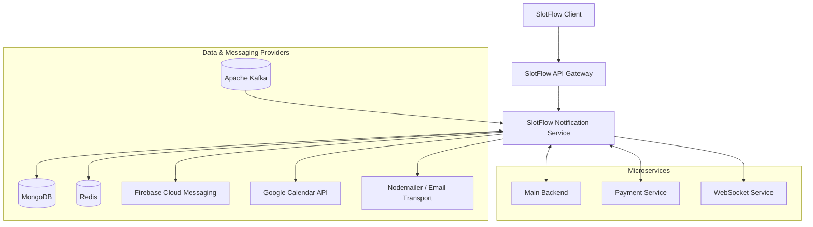

 <div align="center">

# SlotFlow Notification Service

### Notifications, simplified.

A dedicated notification microservice powering SlotFlow's transactional emails, push notifications, user notification preferences, device registration, and event-driven communication workflows.


---

### Live Link & Repositories

<a href="https://slotflow.online">
  
</a>
<a href="https://github.com/slotflow">
  
</a>

### Technology Stack


</div>

---

## Overview

The **SlotFlow Notification Service** is a dedicated notification microservice within the SlotFlow appointment booking platform. It centralizes notification-related operations and enables communication between platform services and users through transactional emails, push notifications, and event-driven workflows.

Built with Node.js, TypeScript, and Express 5, the service leverages Apache Kafka for asynchronous event processing and MongoDB for persistent notification data and processing state. Nodemailer provides email transport capabilities, while Firebase Admin SDK enables Firebase Cloud Messaging (FCM) push notifications.

The service also incorporates Google Calendar integration logic for calendar-related event workflows.

Its layered architecture separates HTTP presentation, application use cases, domain responsibilities, infrastructure integrations, and persistence to support maintainability and modular service development.

---

## Core Features

### Transactional Email Notifications

- Email delivery using Nodemailer.
- Gmail SMTP integration for transactional email transport.
- Reusable email templates for notification messages.
- Kafka-driven processing of email-related events.
- Amazon Simple Email Service (SES) integration components for email delivery workflows.

### Push Notifications

- Firebase Admin SDK integration.
- Firebase Cloud Messaging (FCM) support for push notification delivery.
- User device registration using FCM tokens.
- Device metadata persistence, including device identifiers and platform information.
- Notification preference management for push notifications.

### In-App Notification Data

- MongoDB-backed notification persistence.
- Paginated notification retrieval.
- User-specific notification preferences.
- APIs for retrieving and updating notification settings.
- Persistent records for event-processing workflows.

### Event-Driven Architecture

- Apache Kafka integration for asynchronous inter-service communication.
- Consumer workflows for email, notification, and calendar-related events.
- Event-processing state persistence.
- Retry and dead-letter handling infrastructure.
- Processed-event records with a configurable seven-day time-to-live (TTL).

### Google Calendar Integration

- Google Calendar API integration for calendar-related workflows.
- Application use cases for calendar operations.
- Event-driven processing of calendar-related events.
- Google API authentication and authorization integration components.

### Notification Preference Management

- Retrieve user notification preferences.
- Update push notification preferences.
- Dedicated push-preference endpoints.
- General notification preference update endpoints.
- MongoDB persistence for notification preference settings.

### Observability & Reliability

- Winston-based application logging.
- OpenTelemetry instrumentation and telemetry export configuration.
- Persistent event-processing records.
- Retry and dead-letter handling infrastructure.
- Environment-driven application configuration.

---

## Technology Stack

### Runtime & Backend

<p align="left">
  
  
  
  
  
</p>

### Messaging & Event Processing

<p align="left">
  
  
</p>

### Email & Push Notifications

<p align="left">
  
  
  
  
  
</p>

### Data & Persistence

<p align="left">
  
  
</p>

### Calendar Integration

<p align="left">
  
  
</p>

### Logging & Observability

<p align="left">
  
  
  
  
  
  
  
</p>

### Development & Quality

<p align="left">
  
  
  
  
  
</p>

---

## Architecture

The Notification Service provides a centralized communication layer between SlotFlow backend services and external notification providers. Apache Kafka enables asynchronous event consumption, while application use cases coordinate notification workflows and infrastructure adapters interact with MongoDB, email delivery systems, Firebase Cloud Messaging, and Google Calendar.

The HTTP API provides notification retrieval, preference management, and device registration capabilities.



### Architecture Principles

- Dedicated microservice for notification-related workflows.
- Separation of HTTP routes, application use cases, domain logic, and infrastructure integrations.
- Apache Kafka for asynchronous inter-service communication.
- MongoDB for notification data and event-processing state.
- Nodemailer for email transport integration.
- Firebase Admin SDK for push notification delivery.
- Google Calendar API integration for calendar-related workflows.
- Retry and dead-letter handling for event-processing workflows.
- Environment-driven configuration for application integrations.

---

## Data & Infrastructure

### MongoDB

MongoDB provides persistent storage for notification-related data and event-processing state.

Key responsibilities include:

- Notification persistence and retrieval.
- User notification preferences.
- Registered user-device information.
- Kafka event-processing records.
- Processed-event state and expiry.

Mongoose provides the MongoDB object-modeling layer. Processed-event records use a configured seven-day TTL to manage the retention of event-processing data.

### Apache Kafka

Apache Kafka enables asynchronous communication between the Notification Service and other SlotFlow services.

Consumer workflows support:

- Email notification processing.
- Notification-related event handling.
- Google Calendar-related operations.

The event-processing infrastructure incorporates retry and dead-letter handling mechanisms to support fault-tolerant asynchronous workflows.

### Email Infrastructure

Nodemailer provides email transport integration, with Gmail SMTP used for transactional email delivery.

The service also includes Amazon Simple Email Service (SES) integration components, providing an additional option for email infrastructure configuration.

Email workflows support notification templates, event-driven processing, and integration with the wider SlotFlow platform.

### Firebase Cloud Messaging

Firebase Admin SDK connects the service to Firebase Cloud Messaging for push notification delivery.

Device registration and notification preferences enable the service to associate user devices with notification workflows. Device identifiers, platform information, and FCM tokens support device management and notification targeting.

### Google Calendar

Google Calendar API integration supports calendar-related application workflows.

Calendar functionality is organized around application use cases and event-driven processing, enabling calendar operations to fit within SlotFlow's broader appointment-booking ecosystem.

---

## Project Structure

The service follows a layered Node.js and TypeScript architecture that separates presentation, application logic, domain responsibilities, and infrastructure integrations.

```text
slotflow-notification/
├── src/
│   ├── application/
│   ├── config/
│   ├── domain/
│   ├── infrastructure/
│   ├── presentation/
│   ├── shared/
│   └── server.ts
├── package.json
├── pnpm-lock.yaml
├── tsconfig.json
├── vitest.config.ts
└── README.md
```

The structure illustrates the service's architectural organization, with application workflows, configuration, domain logic, infrastructure adapters, presentation components, and shared utilities organized into separate modules.

---

## Observability

- **Logging:** Winston provides application logging, including console output and development file logging.
- **Distributed telemetry:** OpenTelemetry instrumentation supports application observability.
- **Telemetry export:** OpenTelemetry exporters provide integration with external telemetry collection systems.
- **Event-processing visibility:** MongoDB records provide persistent tracking of event-processing state.
- **Failure handling:** Kafka processing infrastructure incorporates retry and dead-letter handling mechanisms.
- **Dependency monitoring:** Kafka, MongoDB, email transport, Firebase, and Google API integrations form part of the service's operational dependency landscape.

---

## Related Repositories

Explore the SlotFlow ecosystem and its supporting services.

<div align="center">

<a href="https://github.com/slotflow/slotflow-client">
  
</a>
<a href="https://github.com/slotflow/slotflow-backend-main">
  
</a>
<a href="https://github.com/slotflow/slotflow-socket">
  
</a>
<a href="https://github.com/slotflow/slotflow-payment">
  
</a>
<a href="https://github.com/slotflow/slotflow-notification">
  
</a>
<a href="https://github.com/slotflow/slotflow-infra">
  
</a>

</div>

---

## Project Highlights

- Dedicated notification microservice for the SlotFlow platform.
- Kafka-driven asynchronous event processing.
- Transactional email delivery using Nodemailer and Gmail SMTP.
- Firebase Cloud Messaging integration for push notifications.
- MongoDB persistence for notifications, preferences, device registrations, and processing state.
- API endpoints for notification preference management.
- Google Calendar integration for calendar-related workflows.
- Retry and dead-letter handling infrastructure for event processing.
- Winston logging and OpenTelemetry instrumentation.
- TypeScript-based Node.js implementation.
- Layered architecture separating application workflows and infrastructure adapters.

---

## License

**Proprietary — All Rights Reserved**

Copyright © 2026 SlotFlow.

The SlotFlow source code and associated assets are proprietary and confidential property of SlotFlow.

No permission is granted to any person or organization to:

- Use the software for personal, commercial, or production purposes.
- Copy, reproduce, or redistribute the source code.
- Modify, adapt, or create derivative works.
- Sell, sublicense, lease, or otherwise commercialize the software.
- Incorporate any portion of the software into another product or service.
- Host or deploy the software without explicit written permission.

Viewing the source code on GitHub does not grant any license or rights to use, modify, distribute, or commercialize the software.

Any use beyond viewing the repository requires prior written permission from SlotFlow.

All rights reserved.

---

<div align="center">

### SlotFlow Notification Service

**Notifications, simplified.**

<a href="https://slotflow.online">Live Application</a>
·
<a href="https://github.com/slotflow">GitHub Organization</a>

© 2026 SlotFlow Technologies Private Limited

</div>
